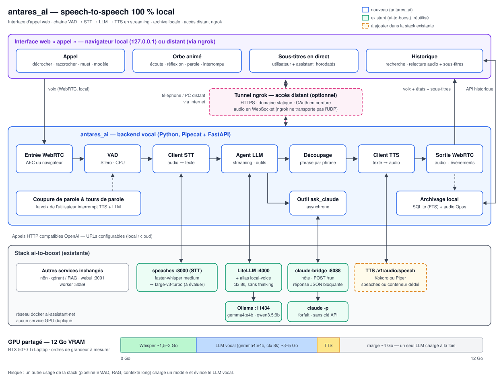

# Analyse — outil speech-to-speech 100 % local

- **Projet** : antares_ai
- **Date** : 2026-09-21
- **Statut** : brouillon — décisions en attente (cf. [§ 11](#11-décisions-à-prendre))
- **Périmètre** : assistant vocal entièrement local, s'appuyant sur les LLM Ollama, la gateway
  LiteLLM et Claude Code (forfait), déjà en place dans la stack `ai-to-boost`

---

## 1. Synthèse

- **Architecture retenue (proposition)** : chaîne en cascade **VAD → STT → LLM → TTS**, en
  streaming phrase par phrase, orchestrée par **Pipecat** (Python).
- **Positionnement** : antares_ai est un **client** de la stack `ai-to-boost` existante
  (speaches, LiteLLM/Ollama, claude-bridge). Il ne relance **aucun service GPU** en double.
- **Manques à combler** : la synthèse vocale (TTS), la détection de parole (VAD), la
  coupure de parole (barge-in) et le transport audio.
- **Claude Code** : ne peut pas être le cerveau de la boucle vocale (latence de `claude -p`).
  Il intervient comme **outil asynchrone** (`ask_claude`) pour les demandes complexes.
- **Contrainte dimensionnante** : **12 Go de VRAM** partagés — un seul LLM vocal chargé à la fois.
- **Latence visée** : environ **0,6 à 1,4 s** entre la fin de la phrase de l'utilisateur et le
  premier son de la réponse.

## 2. Architecture cible

**Flux nominal** :

1. La **capture audio** (PipeWire en local, ou WebRTC dans un navigateur) envoie le flux au **VAD**.
2. Le **VAD** (Silero, CPU) détecte la fin de phrase et transmet le segment au **client STT**.
3. Le **client STT** appelle speaches (`/v1/audio/transcriptions`) et obtient le texte.
4. L'**agent LLM** appelle LiteLLM (alias `local-voice`, en streaming), qui route vers Ollama.
5. Le **découpage** envoie chaque phrase complète au **client TTS** dès qu'elle est prête.
6. Le **client TTS** appelle `/v1/audio/speech` et la **lecture audio** joue le résultat.
7. Si l'utilisateur reprend la parole, la **coupure de parole** interrompt la génération
   du LLM et la lecture en cours.
8. Pour une demande complexe, l'agent appelle l'**outil `ask_claude`**, qui passe par
   claude-bridge puis `claude -p`, en asynchrone.

## 3. Existant réutilisable

Inventaire réalisé le 2026-09-21 sur le poste de développement.

| Brique                        | Service existant (`ai-to-boost`)                             | État pour le speech-to-speech                                   |
| ----------------------------- | ------------------------------------------------------------ | --------------------------------------------------------------- |
| STT                           | `speaches` `:8000` — faster-whisper-medium, CUDA, fp16       | OK, API compatible OpenAI                                       |
| LLM local                     | Ollama `:11434` (gemma4:e4b, qwen3.5:9b) via LiteLLM `:4000` | OK, streaming possible                                          |
| Claude                        | `claude-bridge` `:8088` sur l'hôte (`claude -p`, forfait)    | OK, mais **bloquant** : réponse JSON complète, pas de streaming |
| TTS                           | —                                                            | **manquant**                                                    |
| VAD, coupure de parole, audio | —                                                            | **manquant**                                                    |

- **Matériel** : NVIDIA RTX 5070 Ti Laptop (**12 Go VRAM**), 62 Go de RAM.
- **Contrainte héritée (ADR 0002 d'ai-to-boost)** : Claude uniquement via `claude -p` avec le
  forfait, jamais d'`ANTHROPIC_API_KEY`.
- **Cohérence avec l'existant (ADR 0006 d'ai-to-boost)** : un « futur frontend voix » doit
  réutiliser le contrat de gateway. antares_ai correspond exactement à ce frontend.

## 4. Options d'architecture

### A. Chaîne en cascade VAD → STT → LLM → TTS — recommandée

- La réponse du LLM est découpée phrase par phrase et chaque phrase est synthétisée dès
  qu'elle est complète : l'assistant commence à parler avant la fin de la génération.
- Chaque brique réutilise l'existant et reste **remplaçable** indépendamment.
- Toutes les briques exposent des API compatibles OpenAI : **portable vers le cloud** sans
  réécriture.

### B. Modèle speech-to-speech natif (Moshi, Qwen-Omni, Ultravox…) — écartée pour l'instant

- Latence théorique plus faible.
- Mais : français faible ou non garanti, modèles corrects au-delà de 12 Go de VRAM, et
  **impossible d'y brancher les LLM Ollama ou Claude** (bloc fermé).
- À réévaluer plus tard derrière la même interface.

### C. Produit existant (voice mode d'Open WebUI, etc.) — banc de comparaison uniquement

- Rapide à tester, mais hors du contrat de gateway, sans intégration à la webui ai-to-boost
  ni routage vers Claude Code.

## 5. Choix des briques (option A)

| Brique                   | Recommandation                                                | Alternatives                    | Remarques                                                                                                                             |
| ------------------------ | ------------------------------------------------------------- | ------------------------------- | ------------------------------------------------------------------------------------------------------------------------------------- |
| Orchestration temps réel | **Pipecat** (Python)                                          | LiveKit Agents                  | Pipecat gère VAD, découpage, coupure de parole, services compatibles OpenAI et transports local ou WebRTC. LiveKit ajoute un serveur. |
| VAD                      | **Silero VAD**, sur CPU                                       | —                               | Coût en ressources négligeable.                                                                                                       |
| STT                      | speaches existant, passage à **large-v3-turbo**               | medium actuel                   | Meilleur en français et plus rapide que medium. VRAM à mesurer.                                                                       |
| LLM                      | **`local-gemma`** via LiteLLM                                 | `local-qwen`                    | Créer un **alias dédié `local-voice`** : contexte court (~8k), raisonnement désactivé, consigne de réponses brèves.                   |
| TTS                      | **Kokoro** (82M, GPU ou CPU) ou **Piper** (CPU, voix `fr_FR`) | Chatterbox multilingue, XTTS-v2 | Le français est le point faible de Kokoro : écouter avant de trancher.                                                                |
| Service TTS              | `/v1/audio/speech` de speaches                                | conteneur dédié                 | **À vérifier** : support TTS dans l'image speaches utilisée.                                                                          |
| Audio local              | PipeWire (sounddevice)                                        | navigateur (WebRTC)             | Le navigateur fournit l'annulation d'écho, indispensable pour la coupure de parole sans casque.                                       |

**Point d'attention LLM** : `OLLAMA_CONTEXT_LENGTH=32768` gonfle le cache KV et le temps avant
le premier token. L'alias vocal doit fixer un contexte court par requête (connecteur
`ollama_chat/` avec `num_ctx`, comme les alias « long » existants).

**Licences TTS** : XTTS-v2 (CPML) et les poids de F5-TTS sont **non commerciaux**.

## 6. Intégration de Claude Code

`claude -p` ne convient **pas** comme cerveau de la conversation : lancement du processus
plus génération = plusieurs secondes, et le bridge actuel renvoie la réponse d'un bloc.

| Rôle                             | Description                                                                                                                                                                                              | Statut                                         |
| -------------------------------- | -------------------------------------------------------------------------------------------------------------------------------------------------------------------------------------------------------- | ---------------------------------------------- |
| 1. Escalade par outil            | Le LLM local mène la conversation ; pour une demande complexe, il appelle `ask_claude`. L'assistant annonce « je transmets à Claude » puis lit la réponse à son arrivée (asynchrone, conforme ADR 0006). | **Recommandé**                                 |
| 2. Bridge en streaming           | Ajouter un mode `--output-format stream-json` au bridge pour lire la réponse de Claude phrase par phrase.                                                                                                | Évolution d'ai-to-boost, hors de ce repo       |
| 3. Piloter Claude Code à la voix | Dictée vers une session Claude Code ; un hook `Stop` lit la réponse en synthèse vocale. Pas de temps réel.                                                                                               | Cas d'usage distinct, livrable rapide possible |

Les trois rôles respectent la règle CGU : Claude uniquement via `claude -p` ou le CLI.

## 7. Budget VRAM (12 Go)

Ordres de grandeur, **à mesurer** en phase 0.

| Composant               | Estimation                                                                              |
| ----------------------- | --------------------------------------------------------------------------------------- |
| Whisper large-v3-turbo  | ~1,5 à 3 Go (int8 ou fp16)                                                              |
| gemma4:e4b, contexte 8k | ~3 à 5 Go (le commentaire LiteLLM indique ~3,3 Go, Ollama annonce un fichier de 9,6 Go) |
| Kokoro                  | < 1 Go (0 avec Piper sur CPU)                                                           |
| **Total**               | **~6 à 9 Go** — tient avec **un seul LLM chargé**                                       |

- Avec qwen3.5:9b à la place de gemma, le budget devient serré.
- `OLLAMA_KEEP_ALIVE=30m` garde le modèle chaud : favorable à la latence.
- **Risque** : un autre usage de la stack (pipeline BMAD, RAG, contexte long) charge un
  modèle et **évince** le LLM vocal.

## 8. Budget de latence

| Étape                                 | Cible            |
| ------------------------------------- | ---------------- |
| Détection de fin de parole (VAD)      | 200 à 400 ms     |
| STT d'une phrase courte               | 150 à 300 ms     |
| Premier token du LLM (modèle en VRAM) | 150 à 400 ms     |
| Synthèse de la première phrase        | 100 à 300 ms     |
| **Total perçu**                       | **~0,6 à 1,4 s** |

## 9. Risques

| Risque                                     | Impact                                                | Mitigation                                                                    |
| ------------------------------------------ | ----------------------------------------------------- | ----------------------------------------------------------------------------- |
| Qualité du TTS français                    | Expérience dégradée                                   | Écoute comparative Kokoro / Piper / Chatterbox en phase 0                     |
| Écho et coupure de parole                  | L'assistant s'interrompt lui-même                     | Casque au début, puis annulation d'écho WebRTC ou module echo-cancel PipeWire |
| Concurrence VRAM avec le reste de la stack | Rechargement du modèle, latence de plusieurs secondes | Alias vocal dédié, un seul LLM chargé, surveillance `ollama ps`               |
| Latence de Claude                          | Silence prolongé                                      | Claude uniquement en escalade asynchrone, annonce vocale                      |
| Modèle « raisonnant » (qwen3.5)            | Latence élevée, contenu vide                          | Raisonnement désactivé (problème déjà rencontré dans ai-to-boost)             |
| Licences TTS                               | Blocage d'un usage commercial                         | Écarter XTTS-v2 et F5-TTS si usage commercial                                 |
| Support TTS de speaches                    | Service manquant                                      | Vérification en phase 0, repli sur un conteneur dédié                         |

## 10. Feuille de route

| Phase                   | Contenu                                                                                                                                   | Livrable                  |
| ----------------------- | ----------------------------------------------------------------------------------------------------------------------------------------- | ------------------------- |
| 0. Benchmark (~1 j)     | Latence STT (medium vs large-v3-turbo), temps avant premier token des deux LLM, écoute de 3 TTS en français, vérification du TTS speaches | ADR « choix des modèles » |
| 1. MVP CLI push-to-talk | Micro → STT → LLM en streaming → TTS phrase par phrase → haut-parleur, sans VAD ni coupure                                                | Script CLI fonctionnel    |
| 2. Temps réel           | Passage à Pipecat, VAD Silero, coupure de parole, tours de parole                                                                         | Conversation mains libres |
| 3. Claude               | Outil `ask_claude` via le bridge, annonce vocale, réponse asynchrone ; optionnel : streaming dans le bridge                               | Escalade vers Claude      |
| 4. Interface            | Page web WebRTC (annulation d'écho) ou intégration à la webui ai-to-boost                                                                 | Interface navigateur      |
| 5. Cloud                | Conteneurisation d'antares_ai, endpoints paramétrables                                                                                    | Déploiement cloud         |

## 11. Décisions à prendre

1. **Cas d'usage principal** : assistant conversationnel vocal, ou pilotage de Claude Code à
   la voix (§ 6, rôle 3) ?
2. **Langue** : français seul, ou français et anglais ?
3. **Interaction** : push-to-talk d'abord, ou mains libres dès le début ?
4. **Positionnement** : client de la stack ai-to-boost (recommandé) ou projet autonome avec
   ses propres services ?
5. **Usage commercial** envisagé ? Détermine les licences TTS acceptables.
