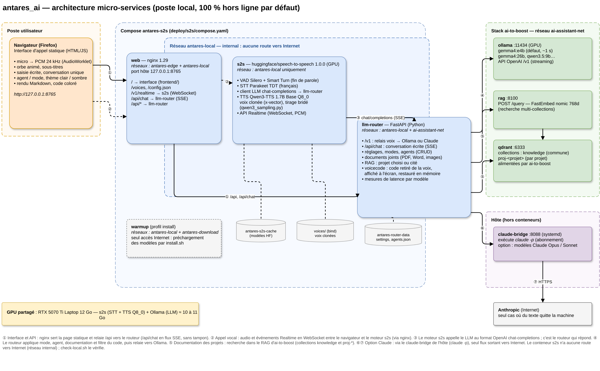
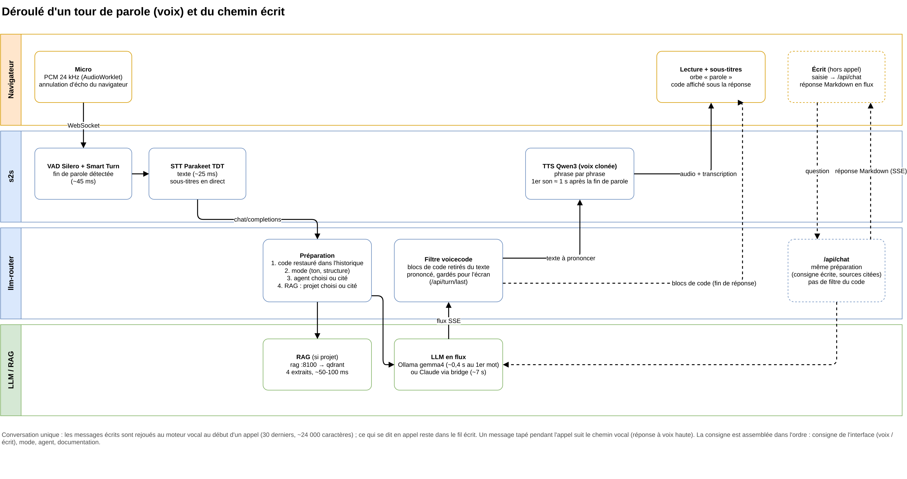

# antares_ai — dossier de solution

> État au 2026-09-29 (branche `develop`). Schémas : [`assets/antares-architecture.drawio`](assets/antares-architecture.drawio)
> (source modifiable dans draw.io), exports PNG dans `assets/`.

## Sommaire

1. [Introduction](#1-introduction)
2. [Objectifs](#2-objectifs)
3. [Description fonctionnelle](#3-description-fonctionnelle)
4. [Architecture technique](#4-architecture-technique)
5. [Choix techniques](#5-choix-techniques)
6. [Annexes : limites connues et suite](#6-annexes--limites-connues-et-suite)

---

## 1. Introduction

antares_ai est un **assistant conversationnel vocal** qui s'utilise comme un appel
téléphonique : on parle, l'IA répond à voix haute, la conversation s'affiche en
sous-titres. On peut aussi lui écrire, à tout moment, et obtenir des réponses mises en
forme (code coloré, tableaux, citations).

Il tourne **entièrement sur le poste de travail** (GPU grand public, 12 Go de VRAM) et
réutilise la stack d'IA locale existante **ai-to-boost** (Ollama, RAG Qdrant, pont vers
Claude Code) plutôt que de dupliquer ses services. L'usage visé est celui d'un assistant de
travail : questions sur les projets en cours, diagnostic, relecture, rédaction, code.

Ce document décrit la solution telle que livrée à ce jour : ce qu'elle fait, comment elle
est construite, et pourquoi ces choix. Les décisions structurantes sont détaillées dans les
ADR (`docs/adr/0001` à `0004`) ; l'analyse initiale dans
[`analyse-speech-to-speech-local.md`](analyse-speech-to-speech-local.md).

## 2. Objectifs

| Objectif                      | Traduction concrète                                                                                                   | État                         |
| ----------------------------- | --------------------------------------------------------------------------------------------------------------------- | ---------------------------- |
| Conversation vocale naturelle | Latence perçue d'environ 1 s entre la fin de la parole et le premier son                                              | ~1,0 s (gemma4:e4b)          |
| 100 % local par défaut        | Aucune sortie réseau à l'usage, **prouvée par isolation** (réseau Docker `internal`), pas seulement par configuration | vérifié par `check-local.sh` |
| Installation en une commande  | `./install.sh` précharge tout, puis `docker compose up -d` hors ligne                                                 | fait                         |
| Voix posée et régulière       | Voix clonée stable, sans changement de ton ni emballement                                                             | fait (voix `sohee`)          |
| Assistant de travail          | Documentation des projets (RAG), agents spécialisés, modes de conversation, code expliqué                             | fait                         |
| Voix et écrit                 | Une seule conversation, écrite ou orale, avec réponses mises en forme à l'écrit                                       | fait                         |
| Claude en option              | Modèles Claude utilisables via l'abonnement (`claude -p`), jamais de clé d'API                                        | fait (hors local, signalé)   |
| Portabilité local / cloud     | Composants standards (OpenAI-compatible, conteneurs) pour une cible cloud ultérieure                                  | à faire (phase cloud)        |

## 3. Description fonctionnelle

### 3.1 Appel vocal

- Bouton **Appeler** : le micro est ouvert, l'assistant écoute. Un **orbe animé** montre
  l'état (écoute, l'utilisateur parle, réflexion, parole) et réagit au niveau sonore.
- La fin de parole est détectée automatiquement ; la réponse commence environ une seconde
  plus tard, **phrase par phrase** (la synthèse démarre avant la fin de la génération).
- **Sous-titres en direct** : la transcription de l'utilisateur s'affiche pendant qu'il
  parle, celle de l'assistant pendant qu'il répond, avec la latence mesurée.
- **Coupure de parole** : parler pendant la réponse l'interrompt (annulation d'écho du
  navigateur ; option « couper mon micro pendant la réponse » sans casque).
- Voix au choix (voix clonées) et modèle au choix dans les **Réglages**.

### 3.2 Écrit

- La zone de saisie est **toujours active** :
  - **hors appel**, l'assistant répond à l'écrit, en flux, sans voix ;
  - **pendant l'appel**, le message rejoint la conversation et la réponse est vocale ;
  - **Ajouter au contexte** : le texte (log, adresse, extrait…) est pris en compte sans
    déclencher de réponse.
- **Conversation unique** : l'écrit est rejoué au moteur vocal au début d'un appel, et ce
  qui s'est dit en appel reste dans le fil. **Nouvelle conversation** repart de zéro.
- **Réponses écrites mises en forme** : titres, listes, tableaux, citations, blocs de code
  indentés et colorés avec bouton **Copier**, bloc **Références** listant les documents
  utilisés. Les liens Internet, cités de mémoire par le LLM (qui n'a pas accès au web),
  sont marqués « à vérifier ».

### 3.3 Code demandé à l'oral

Quand on demande du code à la voix (script, commande, requête SQL, configuration), le code
**s'affiche à l'écran**, coloré, sous la réponse, et l'assistant **l'explique** en phrases
au lieu de le lire. Une relance (« modifie ce script pour… ») porte bien sur le code
affiché.

### 3.4 Documents joints

- Trombone ou glisser-déposer : **PDF, Word, texte et code, images**. Chaque document
  apparaît en étiquette (type, taille estimée, « écrit seulement » s'il est trop long
  pour l'oral) et accompagne toutes les questions jusqu'à « Nouvelle conversation ».
- L'assistant s'appuie sur leur contenu et cite le document utilisé ; les images sont
  examinées par le modèle.
- Un document trop long, un PDF scanné ou un format inconnu est **refusé avec la raison**,
  plutôt que tronqué sans prévenir.

### 3.5 Agents et modes

- **Agents** : fiches de consignes réutilisables (rôle, méthode, format de réponse), avec
  un domaine, une utilité et, en option, un projet et un modèle. Un **catalogue de 28
  agents** couvre 8 domaines (Infra & DevOps, Exploitation / SRE, Sécurité, Développement,
  Données, Gestion de projet, Rédaction, Perso). Ils se gèrent depuis Réglages → **Gérer
  les agents** (création, modification, suppression, filtre par utilité).
- **Choix de l'agent** en haut de l'écran d'appel (liste groupée par domaine, avec
  recherche), ou **en le citant** dans la question (« demande au relecteur ADR… ») pour
  une seule question.
- **Modes** : la manière de répondre pour tout l'appel — Standard, Support / Helpdesk,
  Expert technique, Cool / Relax, Incident / Astreinte, Coach / Formateur,
  Brainstorming, Avocat du diable. Un mode place en tête les agents utiles (« Suggérés »).

### 3.6 Documentation des projets (RAG)

- La documentation indexée par ai-to-boost (collections `knowledge` et `proj-<projet>`)
  est consultée si un **projet est choisi** dans les Réglages, ou si la question **cite un
  projet par son nom**, ou si l'agent actif est rattaché à un projet.
- Les extraits pertinents sont ajoutés à la consigne ; les projets consultés s'affichent
  sous la réponse (et, à l'écrit, dans le bloc Références).

### 3.7 Apparence

- **Thème** clair, sombre ou celui du système.
- **Nuance de couleur** selon le domaine de l'agent actif (teinte seulement, dans une plage
  proche du bleu de base) : accents, bulles, orbe.
- Fenêtres fermables au clic extérieur ou avec Échap, plein écran sur mobile.
- **Avatar** : photo locale animée (défaut si une image est configurée, hors dépôt),
  tête de cyborg argentée en 3D temps réel, en 2D, ou orbe, au choix dans
  les Réglages. Le cyborg
  suit l'état de l'appel : yeux faiblement allumés au repos, qui pulsent en réflexion
  (avec un balayage lumineux), mâchoire qui s'ouvre au rythme de la voix.
- **Voix** : Terminator et Sarah Connor (voix clonées).

## 4. Architecture technique

### 4.1 Vue d'ensemble

La solution est une **chaîne en cascade** (détection de parole → transcription → LLM →
synthèse vocale) servie par trois conteneurs antares, qui s'appuient sur les services de
la stack ai-to-boost.

### 4.2 Composants

| Composant         | Technologie                              | Rôle                                                                                                                                                                                                  |
| ----------------- | ---------------------------------------- | ----------------------------------------------------------------------------------------------------------------------------------------------------------------------------------------------------- |
| **Interface**     | HTML/CSS/JS sans framework (`frontend/`) | Écran d'appel, orbe (canvas), sous-titres, saisie, agents, thème, rendu Markdown (marked, DOMPurify, highlight.js servis localement).                                                                 |
| **web**           | nginx 1.29                               | Seul port exposé (`127.0.0.1:8765`). Sert l'interface, relaie `/v1/realtime` (WebSocket) vers s2s et `/api/*` vers le routeur (`/api/chat` en flux, sans tampon). En-têtes de sécurité (CSP stricte). |
| **s2s**           | huggingface/speech-to-speech 1.0.0, GPU  | Moteur temps réel : VAD Silero + Smart Turn, STT Parakeet TDT, client LLM « chat-completions », TTS Qwen3-TTS 1.7B Base Q8_0 (voix clonée), API Realtime compatible OpenAI.                           |
| **llm-router**    | Python / FastAPI (`deploy/s2s/router/`)  | Cœur applicatif : réglages, modes, agents, RAG, filtre du code à l'oral, conversation écrite, relais vers Ollama ou Claude, mesure des latences.                                                      |
| **warmup**        | même image que s2s (profil `warmup`)     | Utilisé par `install.sh` uniquement : télécharge les modèles dans le cache. Seul conteneur avec accès Internet.                                                                                       |
| **ollama**        | ai-to-boost                              | LLM locaux (gemma4:e4b par défaut, gemma4:26b, qwen3.5:9b…), API OpenAI `/v1`.                                                                                                                        |
| **rag / qdrant**  | ai-to-boost                              | Recherche sémantique (FastEmbed nomic 768d) dans les collections `knowledge` et `proj-*`.                                                                                                             |
| **claude-bridge** | service systemd de l'hôte (ai-to-boost)  | Option Claude : exécute `claude -p` sur l'abonnement de l'utilisateur.                                                                                                                                |

**Modules du routeur** : `router.py` (API, préparation de la consigne, relais),
`documents.py` (extraction, limites, injection des documents joints), `rag.py`
(projets, recherche, injection), `agents.py` + `catalogue.json` (agents), `modes.py`
(modes), `voicecode.py` (code retiré de la voix, restauré en mémoire), `claude.py` (pont
Claude). Le module `qwen3_sampling.py`, chargé dans l'image s2s, règle le tirage de la
synthèse vocale.

### 4.3 Flux

**Tour de parole** :

1. Le navigateur envoie l'audio du micro (PCM 24 kHz) en WebSocket au moteur s2s.
2. La fin de parole est détectée (~45 ms), le texte transcrit (~25 ms) et affiché.
3. s2s appelle le LLM au format OpenAI ; c'est le **routeur** qui répond. Il :
   - remet dans l'historique le code des réponses précédentes (retiré de la voix) ;
   - assemble la consigne : consigne vocale de l'interface, **documents joints**, **mode**,
     **agent** (choisi ou cité), **documentation** (projet choisi ou cité, via `rag`) ;
   - relaie vers Ollama (ou Claude) et filtre le flux : les blocs de code sont retirés du
     texte prononcé et gardés pour l'écran.
4. s2s synthétise la réponse **phrase par phrase** ; le premier son arrive ~1 s après la
   fin de parole.
5. Le navigateur joue l'audio, affiche la transcription, puis les blocs de code et les
   projets consultés (`/api/turn/last`).

**Chemin écrit** : la saisie part vers `/api/chat` ; le routeur applique la même
préparation (consigne écrite, sources citées, pas de filtre du code) et renvoie la réponse
en flux SSE, rendue en Markdown au fil de l'eau.

### 4.4 Réseaux et isolation

| Réseau Docker      | Type                  | Membres                      | Rôle                                                         |
| ------------------ | --------------------- | ---------------------------- | ------------------------------------------------------------ |
| `antares-local`    | **internal**          | web, s2s, llm-router, warmup | Réseau privé du moteur : **aucune route vers Internet**.     |
| `antares-edge`     | bridge                | web                          | Publication du port `127.0.0.1:8765` vers l'hôte uniquement. |
| `ai-assistant-net` | externe (ai-to-boost) | llm-router                   | Accès à Ollama, rag et qdrant.                               |
| `antares-download` | bridge                | warmup                       | Téléchargement des modèles à l'installation.                 |

Le moteur s2s, qui traite l'audio, n'est branché que sur `antares-local` et tourne en mode
hors ligne Hugging Face : même mal configuré, il ne peut rien envoyer à l'extérieur.
`check-local.sh` le prouve (Hugging Face, OpenAI et 1.1.1.1 injoignables). Le seul flux
sortant possible est l'**option Claude**, choisie explicitement et signalée « hors local »
dans l'interface ; l'audio et la transcription restent locaux dans tous les cas.

### 4.5 Données et configuration

| Donnée                              | Emplacement                                                                                      |
| ----------------------------------- | ------------------------------------------------------------------------------------------------ |
| Modèles (STT, TTS, VAD)             | volume `antares-s2s-cache`                                                                       |
| Réglages, agents, latences mesurées | volume `antares-router-data` (`settings.json`, `agents.json`, `observed.json`)                   |
| Documents joints (texte extrait)    | volume `antares-router-data` (`documents/`), supprimés à « Nouvelle conversation »               |
| Voix clonées                        | `deploy/s2s/voices/` (+ `voices.json`)                                                           |
| Profil par défaut                   | bloc `x-profile` de `deploy/s2s/compose.yaml` (modèle, moteurs, quantification, tirage TTS, RAG) |
| Thème                               | navigateur (`localStorage`)                                                                      |
| Conversation                        | mémoire de la page (pas encore archivée)                                                         |

### 4.6 Ressources

GPU **RTX 5070 Ti Laptop 12 Go**, partagé : s2s (STT + TTS Q8_0) et Ollama (LLM) occupent
**environ 10 à 11 Go**. Un modèle différent par agent est possible mais provoque un
rechargement (quelques secondes) et évince le modèle précédent.

## 5. Choix techniques

| Sujet                 | Choix                                                                               | Alternatives écartées                                   | Justification (mesures)                                                                                                                                                                        | Réf.     |
| --------------------- | ----------------------------------------------------------------------------------- | ------------------------------------------------------- | ---------------------------------------------------------------------------------------------------------------------------------------------------------------------------------------------- | -------- |
| Moteur temps réel     | huggingface/speech-to-speech 1.0.0 conteneurisé                                     | cascade maison (Pipecat), modèle speech-to-speech natif | Premier appel fonctionnel en un jour ; API Realtime compatible OpenAI ; texte à chaque étape (sous-titres). Les modèles natifs sont faibles en français et incompatibles avec Ollama / Claude. | ADR 0001 |
| Transport audio       | WebSocket (API Realtime)                                                            | WebRTC                                                  | Compatible avec un accès distant futur via ngrok (pas d'UDP).                                                                                                                                  | ADR 0001 |
| Transcription         | Parakeet TDT                                                                        | faster-whisper (speaches)                               | ~25 ms par phrase, bon français.                                                                                                                                                               | ADR 0001 |
| LLM                   | Ollama **en direct** via le routeur, gemma4:e4b par défaut                          | LiteLLM                                                 | LiteLLM perd `reasoning_effort=none` en streaming (latence ×3). e4b : ~1,0 s ; 26b : 2,1-3,5 s, meilleure qualité.                                                                             | ADR 0001 |
| Synthèse vocale       | Qwen3-TTS 1.7B Base **Q8_0**, voix **clonée** `sohee`                               | Kokoro, Piper, locuteurs prédéfinis                     | Clonage : similarité de timbre 0,965 contre 0,81. BF16 ne tient pas en VRAM.                                                                                                                   | ADR 0001 |
| Régularité de la voix | tirage T 0.3, top_k 10, **pénalité de répétition 1.2**, plafond 1,5 trame/caractère | tirage amont (0.9 / 50)                                 | Écart-type de hauteur 24 → 14 Hz ; emballements (voix qui déraille jusqu'à 28 s) 7/120 → 0/120.                                                                                                | ADR 0001 |
| Claude                | option via le claude-bridge (`claude -p`)                                           | clé d'API Anthropic                                     | Règle héritée d'ai-to-boost (ADR 0002 d'ai-to-boost) ; ~7 s par réponse.                                                                                                                       | ADR 0001 |
| Documentation         | RAG d'ai-to-boost, projet **choisi ou cité**                                        | seuil de score, outil appelé par le LLM                 | Scores non discriminants (0,645 question projet, 0,611 recette). Recherche 40-100 ms, +0,1 s au premier mot.                                                                                   | ADR 0002 |
| Agents                | fiches « consignes » locales, choisies ou citées                                    | agents d'action (worker), choix par le LLM              | Aucune latence ajoutée (0,40 s au premier mot) ; les agents d'action viendront ensuite.                                                                                                        | ADR 0003 |
| Modes et apparence    | mode = ton ; couleur = domaine de l'agent ; thème clair / sombre                    | couleur par mode, fusion modes / agents                 | Deux choix à un clic sur l'écran d'appel, charte cohérente (teinte seule).                                                                                                                     | ADR 0004 |
| Écrit                 | `/api/chat` du routeur, conversation unique                                         | session Realtime sans micro                             | Pas de voix ni de place d'appel occupée ; 1er mot ~0,4 s ; historique rejoué au moteur vocal (vérifié).                                                                                        | —        |
| Rendu                 | marked + DOMPurify + highlight.js **servis localement**                             | CDN                                                     | CSP `script-src 'self'`, fonctionnement hors ligne, HTML nettoyé (injections neutralisées).                                                                                                    | —        |
| Code à l'oral         | blocs retirés du flux vocal par le routeur, restaurés dans l'historique             | laisser le LLM lire le code                             | Règle placée en tête de consigne : SQL 0/3 → 12/12 ; sans restauration, le modèle cesse d'écrire des blocs (0/3 contre 3/3).                                                                   | —        |
| Interface             | page statique sans framework, servie par nginx                                      | React / Next.js                                         | Surface minimale, aucun build, tout local.                                                                                                                                                     | —        |
| Documents joints      | lecture intégrale dans la consigne ; contexte long à l'écrit ; refus au-delà        | RAG sur le document, troncature                         | Ollama tronque sans prévenir ; 65 536 tient sur le GPU avec le moteur vocal (48 800 tokens lus en entier, 17,6 s).                                                                             | ADR 0005 |

## 6. Annexes : limites connues et suite

**Limites connues**

- **Chrome** dégrade la voix au fil d'un appel long (lecture audio du navigateur) :
  utiliser **Firefox** en attendant un correctif de la chaîne de lecture.
- La **conversation n'est pas sauvegardée** : elle se perd au rechargement de la page.
- Le code dicté à l'oral s'affiche **à la fin** de la réponse vocale.
- **12 Go de VRAM** : peu de marge ; un autre usage de la stack peut évincer le LLM.
- Qualité des réponses limitée par gemma4:e4b (citations parfois mal attribuées, liens
  cités de mémoire à vérifier).
- Un seul appel à la fois (une place dans le moteur vocal).

**Suite prévue**

1. **Enrichissement du RAG** par des fiches de connaissance relues avant indexation
   (anti-doublon, validité, obsolescence), via une API d'indexation dans ai-to-boost.
2. **Agents d'action** : délégation au worker ai-to-boost (Claude Code outillé).
3. **Archive et historique** des appels.
4. PDF scannés (reconnaissance de caractères), correctif de lecture sous Chrome, accès
   distant (ngrok), cible cloud.
